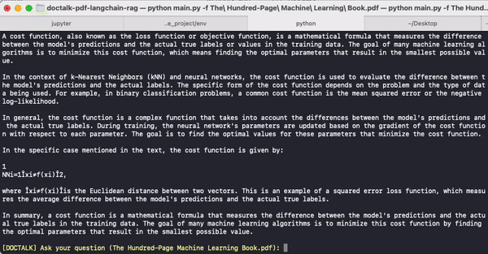

# Doctalk PDF 

This project is a Question-Answering system that uses the `llama3` model to answer questions from a PDF document. It uses the `gpt4all` embedding model to generate embeddings for the questions and the document. The embeddings are then used to retrieve the most relevant paragraphs from the document using `RAG` and added to the context of the `llama3` model to generate the answer.



## Setup ollama and llama3 locally

1. Download and install ollama [instructions here](https://ollama.com/).
2. Download and run the `llama3` model [instructions here](https://ollama.com/llama3/).

## Installation

### Clone the repository:

```bash
git clone https://github.com/cleversonledur/doctalk-pdf-langchain-rag.git

cd doctalk-pdf-langchain-rag
```

### Install the dependencies:

```bash
pip install -r requirements.txt
```
## Usage

Run the following command to start the program:

```bash
python main.py -f <path_to_pdf_file>
```

Depending on the size of the PDF file, it may take a few minutes to load the document and generate the embeddings.

Start talking to the bot:

```bash
[DOCTALK] Ask your question (my.pdf): What is it about?
```

To exit the program, type `exit`.

## Contributing

Please read [CONTRIBUTING.md](CONTRIBUTING.md) for details on our code of conduct, and the process for submitting pull requests.

## License

This project is licensed under the MIT License.

